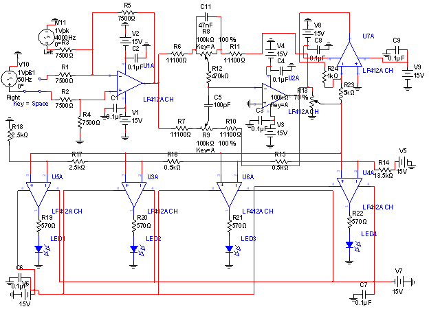

# Tone Control/Karaoke Circuit
## Introduction
I created a tone-control/karaoke-circuit using several techniques and circuit elements which
was covered this semester. This device is often used by DJ’s in order to adjust the bass and
treble of music, and is used in higher-end speaker systems as well. The project utilizes 5
different blocks, each with their own purpose. The first block combines the two channels of
sound into one sound. The second block utilizes the Baxandall tone circuit in order to allow
for adjustments to the bass and treble frequencies of the sound. The third block allows for
volume control. The fourth block has the LED’s that shows the volume level. The last block
amplifies the sound to an acceptable level in order for the output to be of an appropriate
volume.
## Design and Simulation
### Block 1
#### Design Objective
This block accepts two inputs and routes them into an OpAmp. This block consists of
two different modes, controlled by an SPDT switch. The mixer mode is achieved with an
inverted-summing amplifier, while the kareoke mode is achieved using a subtracting amplifier.
1% tolerance resistors were used in this block as this block requires a very precise resistance.
The inputs to this block is from a 3.5mm audio jack, which consists of the left, right, and
ground channel. This block outputs to the second block.
#### Schematic

#### Theory of Operation
This block utilizes two important concepts pertaining to Op-Amps. The mixer mode utilizes
an inverted-summing amplifier, while the karaoke mode utilizes the subtraction amplifier.

The formula for the inverted-summing exam is as follows:

$V_{out} = -\frac{R_{1}}{R_{a}}*V_{a}-\frac{R_{2}}{R_{b}}*V_{b}$

The formula for the subtraction amplifier is as follows:

$V_{out} = -\frac{R_{2}}{R_{1}}*V_{a} + (1+\frac{R_{2}}{R_{1}})(\frac{R_{4}}{R_{3}+R_{4}})*V_{b}$

#### Derivations and Analysis
We need the output voltage of the subtraction amplifier to be -(L+R).  This can be achieved by using resistor values of 1k$\Omega$.

$V_{out} = -\frac{R_{1}}{R_{a}}*V_{a}-\frac{R_{2}}{R_{b}}*V_{b}$

$V_{out} = -\frac{1}{1}*L-\frac{1}{1}*R$

$V_{out} = -(L-R)$

Similarly, for the subtraction amplifier, we need an output of (L-R).  This can also be achieved using 1k$\Omega$ resistor values.

$V_{out} = -\frac{R_{2}}{R_{1}}*V_{a} + (1+\frac{R_{2}}{R_{1}})(\frac{R_{4}}{R_{3}+R_{4}})v$

$V_{out} = -1*V_{a} + (1+1)(\frac{1}{1+1})*V_{b}$

$V_{out} = -1*V_{a} + (2)(\frac{1}{2})*V_{b}$

$V_{out} = -1*V_{a} + (2)(\frac{1}{2})*V_{b}$

$V_{out} = -V_{a} + V_{b}$

$V_{out} = L-R$

#### Simulation Results
This capture has been generated in a simulation using values identical to the measured values in the actual experiment. This waveform exactly matches an oscilloscope capture from the actual experiment, with the SPDT switch put on both ends.

Note that the green line represents the left input, the red line represents the right input, and the orange line represents the output.

### Block 2
#### Design Objective
The purpose of this block is to adjust the treble and bass frequencies of the input signal.  This feature is widely used in the music industry, and it allows for certain sound frequencies to be highlighted.  We want the gain range to be between 1/10 and 10.
#### Schematic

#### Theory of Operation
This block utilizes the baxandall-tone circuit, which has a different gain for the bass and treble components.  We need to ensure that, with a 100k$\Omega$ voltage source, the gain remains between 1/10 and 10.  The regular gain equation for a Op-Amp can be used in this case, as will be seen in the derivation.  In addition, any value of capacitors in the Baxandall-tone circuit is acceptable as long as the capacitor between the potentiometers is significantly smaller than the one on the top of the circuit.  This will ensure that the circuit works properly.
#### Derivations and Analysis
We need to start by using the maximum gain to derive the equation.  Before starting, we know that the equations for the bass and treble part of the circuit will be the same, hence the same resistors will be used in both sections.  This simplifies the calculations quite significantly.  For the maximum gain, we ensure that the potentiometer is set to 0 as it allows the top resistor ($R_{2}$) to be far larger than the bottom resistor ($R_{1}$).  The maximum gain can be found with the equation below:

$Gain = \frac{R_{2}}{R_{1}}$

We know that $R_2$ needs to be large, hence it will be 1000+R, and $R_1$ needs to be small, hence it will be just R.

$10 = \frac{100+R}{R}$

We also know that, for the smallest gain, the denominator must be far larger than the numerator.  Therefore, the potentiometer must be set 100\% of the way to the right.

$\frac{1}{10} = \frac{R}{100+R}$

When you combine the above two equations using simultaneous equations, you get that the resistance R is $11.1k\Omega$.  This is the value of all the resistors.

#### Simulation Results
This capture has been generated in a simulation using values identical to the measured values in the actual experiment. This waveform exactly matches an oscilloscope capture from the actual experiment.

The first image demonstrates the output when both potentiometers are set to 0.  The second image shows when the bass potentiometer is set to 100 while the other is 0, and the third image shows when the treble potentiometer is set to 100 with the other at 0.

Note that the blue line represents the input and the red line represents the output.

### Block 3
#### Design Objective
The purpose of this block is to control the volume of the circuit.  The volume should adjust from 0 until the maximum volume of the input.  This can be done using a potentiometer.
#### Schematic

#### Theory of Operation
This block utilizes a simple potentiometer.  A potentiometer works by allowing for the resistance to be adjusted, but this can be converted into a voltage divider by grounding the bottom terminal and utilizing the middle terminal as an output.  This allows the voltage to be altered, thereby adjusting the volume of the input.
#### Derivations and Analysis
A potentiometer works by allowing you to adjust the resistance of an element.  It works as such:

$V_{out} = V_{total}*\frac{R_2}{R_2+R_1}$

This can be determined through voltage division, as the potentiometer allows for the resistance below the dial to increase and decrease.  Since the resistance below the dial is connected to ground, it also controls the voltage.  Since the amplitude of a sinusoid is the voltage, this allows for the sound to be controlled as well.

### Block 4
#### Design Objective
This block accepts a signal and outputs LED lighting to represent the volume level.  There should be 4 lights, with them turning on at 0.25V, 0.5V, 1V, and 1.5V respectively.
#### Schematic

#### Theory of Operation
This block will utilize a comparator Op-Amp circuit.  This circuit works by comparing the voltages between the positive and negative ports of the Op-Amp.  If the voltage on the positive port is larger, then the light will turn on.  Otherwise, the light will turn off.
#### Derivations and Analysis
A comparator circuit requires certain pieces of information in order to work properly.  Firstly, we must make sure that there is a baseline for the comparator op-amps to compare voltages to.  This can be done by supplying DC power to the circuit, and dividing the voltages using resistors.  We know that we need 0.25V, 0.5V, 1V, and 1.5V.  This can be done by placing two 0.25$k\Omega$ resistors on the bottom, two 0.5$k\Omega$ resistors above that, and a 13.5$k\Omega$.  This can be verified as $0.25+0.25+0.5+0.5+13.5=15$.

It is also necessary for there to be a limiting resistance before the LED.  The limiting resistance can be found with:

$R_{limiting} = \frac{v_a-v_b-v_d}{desired current}$

Where $v_a$ is the voltage prior to the diode, $vb$ is the voltage after the diode, and $v_d$ is the voltage of the diode.  $v_a$ will equal 15V since comparator op-amps output the voltage from the positive DC terminal.  $v_b$ will be zero as the voltage below the diode is zero.  $v_d$ will be 3.3V as the voltages of the diodes we use in class are that value.  The desired current is 10mA, as that is an appropriate current for an LED of this size.

When we plug all the values in, we obtain 1170k$\Omega$.

### Block 5
#### Design Objective
The purpose of this block is to counteract the gains from the op-amps in the previous blocks in order for the output to be at an acceptable volume.
#### Schematic

#### Theory of Operation
This block utilizes a simple inverting op-amp.  The gain of this block should be designed to counteract the gains of all the previous blocks.  The equation for the gain is $Gain=\frac{R_2}{R_1}$ where $R_2$ is the bypass resistor for the op-amp and $R_1$ is the resistor before the op-amp.
#### Derivations and Analysis
The goal of this block is to counteract the gains of the previous blocks.  We know that the gain of the first block is 1 because all the resistors are the same.  We also know that the maximum possible gain for both the treble and the bass parts of the Baxandall-tone circuit is $10$.  Since both circuits can be set to maximum gain, the maximum gain of the circuit is $10+10=20$.  Therefore, we need a gain that will counteract this gain.  This can be done by using a gain of $\frac{1}{10}$.  We know that the formula for the gain of a an inverting op-amp is the resistance of the bypass resistor over the resistance of the resistor on the positive terminal of the op-amp.  Therefore, we can use a 20k$\Omega$ resistor for the first resistor and a 1k$\Omega$ resistor for the bypass resistor.  This will make the maximum overall gain of the overall circuit 1.
#### Simulation Results
This capture has been generated in a simulation using values identical to the measured values in the actual experiment. This waveform exactly matches an oscilloscope capture from the actual experiment.

The first image demonstrates the output when both potentiometers are set to 0.  The second image shows when the bass potentiometer is set to 100 while the other is 0, and the third image shows when the treble potentiometer is set to 100 with the other at 0.

Note that the blue line represents the input and the red line represents the output.

## Complete Assembly and Breadboard Images

Red: Block 1

Yellow: Block 2

Green: Block 3

Blue: Block 4

Purple: Block 5

## Conclusion
This project was a smashing success for me.  I was able to complete the breadboard prototype and the PCB in time, and they both worked perfectly.

There were several hiccups that I encountered.  Firstly, I ran out of wires quite quickly for the breadboard, and this was mainly because I used a relatively large breadboard.  Secondly, I had trouble debugging my wiring on the breadboard as the wires and elements started to be placed too close to each other, leading to a lot of confusion.  I also had a lot of trouble soldering the PCB, with me soldering the 9V battery the wrong way in, requiring me to cut the wire and resolder it the right way.

Overall, this project really allowed me to experience the life of an engineer.  I thoroughly enjoyed it and hope to see similar projects in my future courses at Penn State.
